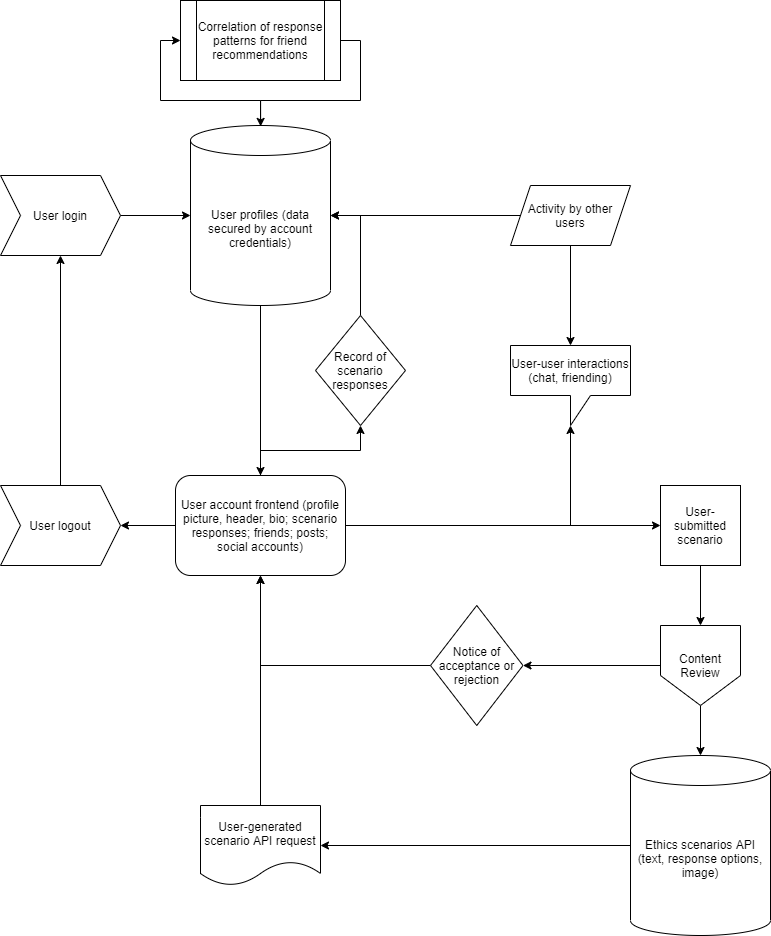

# Software Requirements

## Vision
An application that allows you to go through various moral dilemmas. When going through moral dilemmas, you can see how your answers compare with other users. In addition, customize your own profile, and connect with users that have similar ethical standards OR not. Maybe you want a challenge on the date and to discuss your vastly different perspectives.
Pain Point: Have you ever wondered how you might respond in various moral dilemmas? Well now you can go through a set of moral dilemmas and find out what kind of person you really are. You can also see how your ethical standards align with other users, and even include your own dilemmas. If accepted, your unique dilemma can be added to the API! 

**We don’t care about your gender of size. We just want ya’ll to harmonize.**

The web application consists of a frontend written in HTML, CSS,
Bootstrap/Tailwind, and jQuery. The backend was written in Python/

An interface is provided to create new blog
posts, view existing blog posts, edit existing blog posts, delete existing
blog posts, and search by both keywords and usernames.

### Scope (In/Out)
IN - Making ethical choices in different moral dilemmas and socializing.
Users will able to make different choices in a quiz type game of moral dilemmas. Users will be able to see how other users answered in a percentage/pie chart form. Users will be able to have a profile page. Users will be able to communicate with other users in ways of becoming "friends" and commenting on posts.

OUT - This is not a shopping page.
Our app will not be a online store. Our page is not a hate forum. Our page is not a video game. Our game is not a recipe page.

### **MVP:**
Each moral dilemma will have a corresponding visual. Each moral dilemma will be multiple choice and have follow-up questions to extend the scope of the dilemma. Users will be able to see how their answers match up with others.
In addition, connect with other users to discuss moral dilemmas in a dedicated comment section. Users can submit new moral dilemmas (optional photo) to our own API. We as admins will then decide whether to approve and include it in our application.
Users will have dedicated profiles and can connect with each other and see how much their ethics align. Users can privately message each other and have their own debates. Moreover, users can link their Facebook, Instagram, and LinkedIn accounts to their profiles. Profiles can optionally have a thumbnail photo, header, and bio section.
Potential Stretch Goals:
Generate a page of users that have ethical standards most like your own.
Create the ability for users to add other users to a friends list.
Add the ability for users to use emojis in comments and private messages.
Add an ability for users to have their own walls where they can make various posts.
Add a feed where users can see their friend’s posts.

### Functional Requirements
An admin can create and delete user accounts

A user can update their profile information

A user can search for friends and other users.

## Data Flow

 
 
 

## Non-functional Requirements:

- **Security** - We will be using Auth. Signup information should include safe characters only and be stored securely in a database.

- **Usability** - The overall design and visual appeal of the application should have a semi-diverse color palette and it should be easy for user’s to see where everything is located.

- **Testability** - Tests should be representative of the testing/verification sections of the project management (Trello) board.
